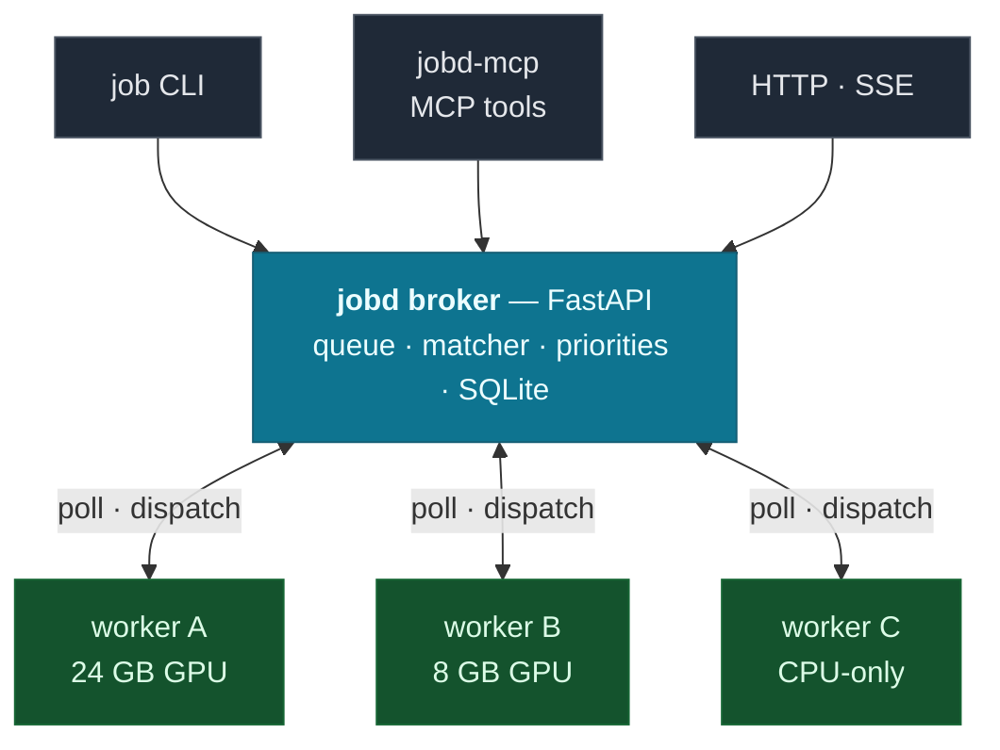

<div align="center">

# jobd

[](https://github.com/musharna/jobd/actions/workflows/ci.yml)
[](https://pypi.org/project/jobd/)

[](LICENSE)

**A self-hostable, GPU-aware job broker for your own machines — with native MCP/agent integration.**

> Like [task-spooler](https://manpages.ubuntu.com/manpages/noble/man1/tsp.1.html), but across more than one machine — and VRAM-aware.

</div>

<p align="center">
  
</p>

You have a couple of boxes with GPUs — a workstation, a server, maybe a laptop — wired together over [Tailscale](https://tailscale.com/) or a LAN. You want to fire off training runs, data pipelines, and long batch jobs from anywhere, have them land on whichever machine actually has the VRAM free, survive across sessions, and get preempted cleanly when something more important shows up. You don't have a cloud, a Kubernetes cluster, or a Slurm install, and you don't want one.

jobd is that missing piece: a small broker that turns a handful of personal machines into a single queue. Think _SkyPilot / Modal, for people without a cloud_ — except the fleet is the hardware you already own, and an LLM agent can drive it directly.

```bash
# from any machine on your tailnet:
job submit --project myproj --gpu --vram-required 16 --wait -- python train.py
# → routed to whichever worker has ≥16 GB VRAM free, streamed back to your terminal
```

## Why it exists

Most schedulers assume a datacenter. The lightweight ones that don't (a bare `nohup`, a tmux session, an ssh-and-pray script) give you nothing: no queue, no VRAM-aware routing, no preemption, no record of what ran where. jobd fills the gap between "ssh in and run it" and "stand up Slurm":

- **VRAM-fit routing.** The broker matches each job against live worker capacity (free VRAM / RAM / CPUs, capability tags, arch/OS) and dispatches to a worker that actually fits — instead of you guessing which box is free.
- **Preempt + checkpoint.** A higher-priority job can preempt a running one: the worker sends `SIGTERM`, the workload gets a grace window to checkpoint, then `SIGKILL`. A preempted job reaches a terminal `preempted` state with a durable checkpoint to resume from — it isn't silently re-run. (See [docs/preemption.md](docs/preemption.md).)
- **Survives sessions.** Submit, close your laptop, check back tomorrow. Jobs live in the broker, not your shell.
- **Agent-native.** Ships a first-class [MCP](https://modelcontextprotocol.io/) server so an LLM agent (Claude Code, etc.) can submit, monitor, and babysit jobs as tool calls — the thing most schedulers bolt on as an afterthought, if at all.
- **Yours.** One broker process you run on a machine you own. No accounts, no egress, no per-GPU-hour billing. Tailnet-bound by default.

## Why not just use…?

| Tool                                                                           | What it gives you                                           | Why jobd instead                                                                                               |
| ------------------------------------------------------------------------------ | ----------------------------------------------------------- | -------------------------------------------------------------------------------------------------------------- |
| **`nohup` / `tmux` / ssh-and-pray**                                            | Runs a command on one box                                   | No queue, no VRAM-aware routing, no preemption, no record of what ran where                                    |
| **[task-spooler](https://manpages.ubuntu.com/manpages/noble/man1/tsp.1.html)** | A real job queue — on a single machine                      | jobd queues across _all_ your machines and routes by live VRAM/CPU fit                                         |
| **Slurm**                                                                      | Datacenter-grade scheduling                                 | Heavy to stand up and operate for 2–3 personal boxes; jobd is one process + a poller per host                  |
| **SkyPilot / Modal / dstack**                                                  | Provision and run on clouds (SkyPilot also on-prem via SSH) | jobd targets hardware you _already own_, with no cloud/K8s assumptions and a much smaller footprint            |
| **Ray**                                                                        | A distributed-compute framework                             | jobd is a job _queue_, not a programming model — submit any command, no code changes, GPU-fit routing built in |

Closest in spirit are task-spooler (single-node) and on-prem SkyPilot (heavier, cloud-shaped). jobd's niche is the 2–3-GPU homelab: multi-machine VRAM-fit routing + preempt/checkpoint + a native agent interface, with nothing to stand up.

## Architecture



Workers **poll** the broker (pull model — no inbound connection to a worker); the broker matches each job against live capacity and hands it back on the poll. One broker process, one poller per host.

- **Broker** — a FastAPI + SQLite service. Holds the queue, runs the matcher, resolves per-project priorities and defaults, exposes a small HTTP API and an SSE stream. Single source of truth.
- **Workers** — lightweight polling agents, one per host. Each advertises live capacity via heartbeat, claims jobs it can run, executes them (`shell=False`, no shell-injection surface), streams logs back, and honors preemption signals.
- **Clients** — the `job` CLI, the `jobd-mcp` MCP server, or anything that speaks the HTTP API.

## Install

```bash
pip install jobd               # broker + CLI
pip install "jobd[mcp]"        # adds the MCP server
pip install "jobd[worker]"     # adds the worker daemon (jobd-worker)
```

Requires Python ≥ 3.11. Everything ships in the one `jobd` package: the broker (`jobd`), the CLI (`job`), the MCP server (`jobd-mcp`), and the worker (`jobd-worker`). The worker's runtime deps (httpx, psutil, pyyaml, nvidia-ml-py) live behind the `[worker]` extra since they're only needed on machines that actually run jobs. `scripts/install-worker.sh` sets a worker up under `~/jobd-worker` with its own venv and a generated config.

## Quickstart (single host)

```bash
# 1. start the broker (binds 127.0.0.1:8765 by default)
JOBD_ALLOW_NO_AUTH=1 jobd          # no-auth is fine for a loopback-only broker

# 2. in another shell, install + start a worker pointed at it
pip install "jobd[worker]"
JOBD_URL=http://127.0.0.1:8765 JOBD_WORKER_HOST=local jobd-worker

# 3. submit a job and wait for it
job submit --project demo --wait -- echo hello
job list
job logs <id>
```

For a real multi-host deployment (Docker broker + systemd workers, Tailscale binding, shared auth token), see **[docs/security.md](docs/security.md)** and the templates in `docker-compose.yml` and `scripts/` (broker compose, `install-worker.sh`, `job-worker.service`). Day-2 operations (health, draining a worker, upgrades, token rotation, backups) are in **[docs/runbook.md](docs/runbook.md)**.

## Supported platforms

Python 3.11+ everywhere.

| Component                              | Linux   | macOS       | Windows              |
| -------------------------------------- | ------- | ----------- | -------------------- |
| **Broker** (`jobd`)                    | ✅      | ✅          | ✅ (WSL recommended) |
| **CLI** (`job`) / **MCP** (`jobd-mcp`) | ✅      | ✅          | ✅                   |
| **Worker** (`jobd-worker`)             | ✅ full | ⚠️ degraded | ⚠️ degraded          |

The **worker** runs its best on Linux with a systemd user instance: memory caps, process reaping, and preemption use `systemd-run --user` scopes and cgroups. On non-systemd hosts the worker still executes jobs, but silently drops those guarantees — fine for a single trusted box, not for hard resource isolation. GPU features need NVIDIA + `nvidia-ml-py`. The broker, CLI, and MCP server are pure-Python and portable.

## CLI

```
job submit -p PROJ [--gpu] [--vram-required N] [--needs TAG]... [--count N | --sweep K=v1,v2]... [--wait] -- CMD...
job list [--state STATE] [--project P] [--array A<id>]   # queue + recent jobs
job status ID | A<id> [--watch]             # one job, or an array's aggregate
job logs ID [-n BYTES]                      # tail captured output
job wait ID                                 # block until terminal
job cancel ID  /  job preempt ID            # stop a job
job workers                                 # fleet snapshot + health
job projects list | set NAME PRI | nudge NAME DELTA
job audit [--project P] [--since 24h]       # event history
```

`job submit --explain` dry-runs the resolution (priority, profile, project defaults, host pin) and prints the effective config without enqueuing anything.

### Job arrays

Submit N jobs from one template with `--count N`. Each member is a normal job — it routes, runs, preempts, and checkpoints independently — and `{i}` in the command is replaced by the member's 0-based index:

```bash
job submit -p train --count 8 -- python train.py --fold {i}
# → Submitted array A42: 8 jobs (ids 42..49)

job list --array A42         # the members, with their index annotations
job status A42               # aggregate: state tally + per-member rollup
```

The array is identified as `A<id>` (the first member's job id). `job status A42` exits non-zero if any member ended in a non-completed terminal state, so it composes with shell `&&`.

For a grid search, use `--sweep KEY=v1,v2,v3` (repeatable) instead of `--count`. The broker fans out the cartesian product of all axes, substituting `{KEY}` per member; `{i}` (the flat member index) is also available:

```bash
job submit -p train --sweep lr=0.1,0.01 --sweep seed=1,2,3 \
  -- python train.py --lr {lr} --seed {seed} --out run-{i}
# → Submitted array A50: 6 jobs (ids 50..55)   # 2 × 3 = 6 members
```

`--sweep` and `--count` are mutually exclusive, the product is capped at 1000 members, and `i` is reserved as an axis key. Substitution is a literal `{key}` replace (not `str.format`), so JSON literals and shell braces in the command pass through untouched.

## MCP / agent integration

jobd ships an MCP server (`jobd-mcp`) exposing the queue as nine tools — `jobd_submit`, `jobd_status`, `jobd_logs`, `jobd_list`, `jobd_cancel`, `jobd_preempt`, `jobd_workers`, `jobd_job_get`, `jobd_worker_delete`. Point your MCP client at it:

```json
{
  "mcpServers": {
    "jobd": {
      "command": "jobd-mcp",
      "env": {
        "JOBD_URL": "http://127.0.0.1:8765",
        "JOBD_API_TOKEN": "<your-token>"
      }
    }
  }
}
```

`JOBD_API_TOKEN` must match the broker's token, or every call returns 401. Omit it only when the broker runs with `JOBD_ALLOW_NO_AUTH=1`.

Now an agent can "run this overnight," check on it next session, and route GPU work through the broker instead of colliding on a shared card. The `examples/claude-code-hooks/` directory has optional [Claude Code](https://docs.claude.com/en/docs/claude-code) hooks that _nudge_ (or hard-block) an agent toward submitting heavy commands through jobd — including a VRAM-aware GPU guard with `# NO_GPU` / `# CONCURRENT_OK` / `# VRAM=NGB` override markers.

## Configuration

Three optional YAML files under `JOBD_CONFIG_DIR` (defaults shipped in `config/`):

- **`projects.yaml`** — per-project base priority and submit defaults (preemptibility, wall/idle timeouts, host pins, capability requirements). See [docs/plans/projects-yaml.md](docs/plans/projects-yaml.md) for the full resolution model.
- **`profiles.yaml`** — named resource bundles (`--profile gpu-train-large`) the matcher uses to size a job.
- **`classifier.yaml`** — rules that auto-suggest a profile from the command string.

All three are optional; with none present, every job runs at the global default priority.

## Security

The broker has **no TCP-layer auth beyond a shared bearer token**, so it is meant to run on a trusted network (loopback or a Tailscale tailnet), never on a public interface. Two stacked controls:

1. **Interface binding** — `JOBD_HOST` must be `127.0.0.1` or a Tailscale CGNAT address (`100.64.0.0/10`), never `0.0.0.0`. A CI lint (`tests/test_deploy_lint.py`) enforces this on the Docker deployment.
2. **Bearer token** — set `JOBD_API_TOKEN` (≥32 random bytes) on every broker/worker/CLI/MCP host. The broker refuses to start without it unless you explicitly set `JOBD_ALLOW_NO_AUTH=1`. **`JOBD_ALLOW_NO_AUTH=1` is for a loopback-only broker (`JOBD_HOST=127.0.0.1`) — for local dev/tests.** Combined with a non-loopback `JOBD_HOST` it exposes an unauthenticated RCE endpoint to your whole tailnet; the broker logs a startup warning if you do this. Don't.

Full threat model, env-var reference, and token rotation: **[docs/security.md](docs/security.md)**.

## License

MIT — see [LICENSE](LICENSE).
